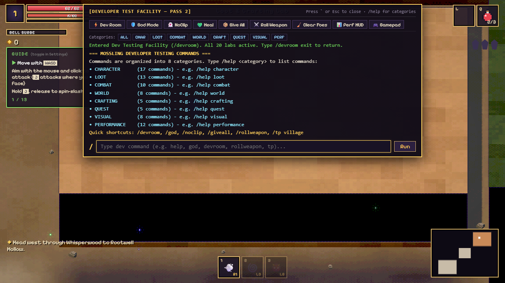
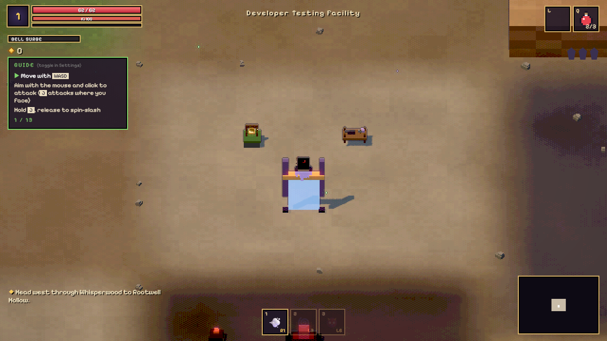
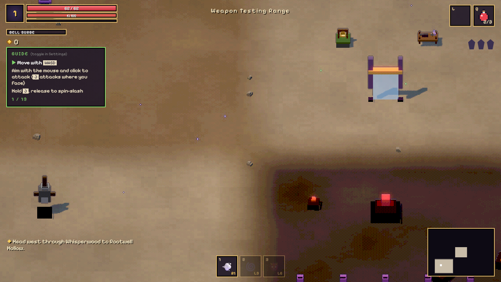

# Mossling Developer Testing Facility — Pass 2

Comprehensive documentation for the expanded developer tooling, the 20 testing labs in `/devroom`, dynamic registry introspection, profile management, and combat telemetry.

---

> [!CAUTION]
> **DEVELOPMENT AND TESTING TOOLING ONLY**
>
> Developer commands and testing facilities are designed exclusively for rapid validation during development.
> **Security Notice**: This architecture relies on **obscurity, not cryptography or authentication**. Client-side JavaScript cannot conceal code execution.
> **NEVER store production secrets, API credentials, or authentication tokens in client-side code.**

---

## 1. Developer Console & Obscure Activation

No public menus or buttons advertise the developer environment to casual testers. Access is enabled via deliberately obscure developer shortcuts:

1. **Backquote / Tilde Key**: Press `` ` `` or `~` anywhere in game.
2. **Key Chord**: Press `Ctrl + Shift + D`.
3. **Hidden Click Gesture**: Click five (5) times rapidly (<600ms) on the bottom-right version footer.
4. **Programmatic Hook**: Run `window.__dev.open()`, `window.__dev.toggle()`, or `window.__dev.execute('/devroom')` from the browser DevTools console.

### Console UX Features
- **Quick-Action Toolbar**: Instant one-click triggers for `Dev Room`, `God Mode`, `NoClip`, `Heal`, `Give All`, `Roll Weapon`, `Clear Foes`, `Perf HUD`, and `Gamepad`.
- **Category Filter Pills**: Quick filters for `ALL`, `CHAR`, `LOOT`, `COMBAT`, `WORLD`, `CRAFT`, `QUEST`, `VISUAL`, and `PERF`.
- **8 Command Categories**: All commands are classified into 8 distinct categories searchable with `/help <category>`.
- **Keyboard Navigation**: `↑` / `↓` command history, `Tab` auto-completion, `Esc` to close.
- **Input Isolation**: Game controls (movement, attacks, abilities) are suppressed while the console is open.



---

## 2. The 20 Specialized Testing Labs in `/devroom`

Entering `/devroom` warps the player to an isolated 60×50 testing map. The player's previous location, orientation, and game state are saved and restored on `/devroom exit`, guaranteeing **zero progress leakage**.



### Lab Directory

| Lab # | Lab Name | Location | Facilities & Capabilities |
|:---|:---|:---|:---|
| **Lab 1** | **Character & Profile Lab** | North-West | Interactive terminals to inspect character profile schema (v3), clone the active profile, create new test profiles for each class, validate save data integrity, and run synthetic migration tests. |
| **Lab 2** | **Inventory Lab** | North-East | Terminals and commands (`/give`, `/giveall`, `/clearbag`, `/deleteitem`) to populate or clear unequipped backpack slots without affecting equipped gear. |
| **Lab 3** | **Rarity & Loot Lab** | North-East | Interactive Loot Chest and terminals to roll 10 multi-affix weapons, spawn max-roll Prismatic chase items (`/perfectroll`), lowest tier items (`/minroll`), or simulate 1M roll distributions (`/droptest`). |
| **Lab 4** | **Equipment & Paper-Doll Lab** | North-West | Nine (9) specialized mannequins representing all canonical slots (`head`, `chest`, `arms`, `legs`, `boots`, `necklace`, `ring1`, `ring2`, `weapon`). Interacting tests slot replacement and stat recalculation. |
| **Lab 5** | **Weapon Test Range** | South-West | Five (5) dedicated combat dummies with real-time damage telemetry, hit counters, and poise meters:<br>• **DPS Dummy** (DPS 1s & 5s window)<br>• **Stagger Dummy** (50 poise break & recovery)<br>• **Armoured Dummy** (50% physical DR mitigation)<br>• **Elemental Dummy** (Reaction vulnerability)<br>• **Boss Dummy** (100,000 HP gauge). |
| **Lab 6** | **Class Quick-Setup Shrines** | West | Three class shrines (`samurai`, `archer`, `witch`) that instantly switch class, equip starter class weapon, and reset ability hotbars. |
| **Lab 7** | **Crafting Lab** | North-East | Posy-style Workbench, Materials Dispenser (+500 shards, +10 of each essence), and Recipe Learner to test crafting recipes, sigil attachments, and engraving transfers. |
| **Lab 8** | **Elemental Reaction Lab** | South-East | Five elemental targets (`burn`, `chill`, `shock`, `wind`, `physical`) displaying status floaters, particle reactions, and damage vulnerabilities. |
| **Lab 9** | **Echo Chamber** | East | Two Verdant Chime pinwheels requiring a 1.5s Echo delay to trigger sequentially, plus an Echo Toggle Shrine to turn Chime echoes on and off. |
| **Lab 10** | **Enemy Lab** | South | Spawner totems for `blot`, `beetle`, `puffer`, `knight`, and `elite` champions. Supports level scaling and `/ai freeze` toggle. |
| **Lab 11** | **Boss Arena & Altar** | South | Boss altar to trigger or warp to Bramblemaw, set boss HP percentage (`/bosshp <pct>`), and reset encounter state (`/bossreset`). |
| **Lab 12** | **Bellstone Lab** | Central Hub | Dev Testing Bellstone to test resting, healing, tonic refill, checkpoint assignment, and discovery registry tracking. |
| **Lab 13** | **Death & Currency Lab** | South-East | Test player death screen, death recap cause attribution (`/killplayer [reason]`), and spawn death currency grave pickups (`/spawngrave [amount]`). |
| **Lab 14** | **Day / Night & Weather Lab** | Central | Terminals and commands (`/time dawn\|day\|dusk\|night\|<frac>`, `/weather rain\|fog\|clear`) adjusting the 420-second solar world clock and atmospheric shaders. |
| **Lab 15** | **Visual Settings Lab** | Central Hub | Presets terminal (`low`, `high`, `default`), camera zoom distance slider (`/zoom 0.75-1.5`), forced pixel scale (`/pixel 2|3|4`), and shadow resolution (`/shadows high|low`). |
| **Lab 16** | **World Teleport Station** | Central Hub | Fast-travel pedestal supporting all named map landmarks (`village`, `forest`, `shore`, `desert`, `cinderpeak`, `mountains`, `mill`, `camp`, `dungeon`, `boss`). |
| **Lab 17** | **Quest & Story Testing** | Central Hub | Commands to inspect flags (`/flags`), set main story stage (`/quest stage <0-3>`), reset or complete side quests (`/quest reset mill`, `/quest complete camp`), and test NPC dialogue (`/talk tamsin`). |
| **Lab 18** | **Performance & Stress Lab** | South | Spawns tracked stress mobs (`/stress enemies 30`), loot drops (`/stress loot 50`), or particle storms (`/stress particles 500`). Guaranteed cleanup with `/stress clear` or upon exiting `/devroom`. |
| **Lab 19** | **Controller / Gamepad Diagnostics** | Central Hub | Telemetry reader (`/gamepad`) reporting connected controllers, left stick vector & magnitude, right stick aim angle (degrees), deadzone activity, and button states. |
| **Lab 20** | **Dev Return Portal** | Central Hub | Safe return portal that teleports player back to their exact previous coordinates in the overworld or dungeon, purging all active stress mobs. |



---

## 3. Dynamic Registry Discovery vs. Hardcoded Systems

To ensure developer tooling does not desynchronize as other agents expand systems, `discoverSystems(game)` inspects live JavaScript registries at runtime:

### Auto-Discovered Systems
- **Character Classes & Roles**: Discovered dynamically from `CLASSES` registry (`samurai`, `archer`, `witch`).
- **Canonical Equipment Slots**: Read from `EQUIPMENT_SLOTS` in `src/persistence/model.js` (all 9 slots).
- **Weapon Bases & Armors**: Discovered from `WEAPONS` and `ARMORS` in `src/rpg/items.js`.
- **Legendary Items**: Discovered from `LEGENDARIES` in `src/rpg/items.js`.
- **Crafting Recipes & Materials**: Discovered from `RECIPES` and `MATS` in `src/rpg/crafting.js`.
- **Enemy Types**: Discovered dynamically by merging `BASE_ENEMY_KINDS` and `EXTRA_ENEMIES` from `src/entities/enemies.js`.
- **Bellstones**: Read dynamically from `BELLSTONES` registry in `src/persistence/model.js`.
- **Stat & Affix Rarity Tiers**: Discovered from `AFFIX_DEFINITIONS` and `AFFIX_RARITY_TIERS` in `src/rpg/affixes.js`.
- **Overworld Regions & Landmarks**: Read directly from `buildOverworld().regions` and `buildOverworld().spawns`.

### Explicitly Documented Authored Systems
Certain systems are inherently scripted encounters or continuous mathematical algorithms rather than registry tables:
1. **Bramblemaw Boss Encounter & Phase 2 Enrage**: Authored finite state machine in `src/entities/boss.js` (`intro` -> `combat` -> `enraged` at <40% HP).
2. **Verdant Chime Echo Door 2-Stage Pinwheel**: Authored timing puzzle in `src/world/maps.js` and `src/story.js` requiring a 1.5s delayed gale.
3. **Oswin Mill Quest State Machine**: Authored quest branching in `src/story.js` (`q_mill` stages 0, 1, 2 and `millyard` prop spawning).
4. **Day / Night Solar Clock Algorithm**: Mathematical formula in `src/persistence/model.js` (420-second cycle with 0.32 phase offset).
5. **Pixel Post-Processing Shaders**: Custom WebGL fullscreen quad shader uniforms in `src/engine/pixel.js`.
6. **Voxel Visual Outfits**: Procedural box-mesh generators in `src/hero.js` (`HELM_LOOK`, `ARMOR_LOOK`).

---

## 4. Complete Slash Command Reference (Organized by 8 Categories)

### CHARACTER
- `/help [category|command]`: Displays list of commands or specific command syntax.
- `/level <1-20>`: Sets character level, recalculates stats and health, awards skill points.
- `/levelup [n]`: Increases character level by `n` (default 1).
- `/leveldown [n]`: Decreases character level by `n` (default 1).
- `/xp <amount>`: Grants experience points, triggering level-ups if threshold is met.
- `/resetxp`: Resets current level progress to 0.
- `/coins <amount>`: Sets current pip/coin wallet balance.
- `/respec`: Refunds all spent skill points and allocated stat points cleanly.
- `/profile`: Dumps active profile summary (ID, class, level, play time, bells discovered).
- `/cloneprofile [name]`: Duplicates active profile into a distinct save slot with new instance IDs.
- `/switchprofile <id|name>`: Switches active character profile without reloading the page.
- `/testprofile <class> [lvl] [name]`: Generates a fully populated test character for any class.
- `/validatesave`: Validates save schema compliance and item identity integrity.
- `/testmigration`: Simulates legacy save migration (v2 -> v3) in memory.
- `/testcorruptfallback`: Verifies recovery fallback from backup when primary save is corrupted.
- `/forcesave`: Flushes active character state and world progress to storage immediately.
- `/reloadprofile`: Reloads active character profile from storage, discarding uncommitted runtime state.

### LOOT
- `/give <id> [count]`: Grants materials, consumables (`potion`, `vessel`), keys (`key`, `bigkey`, `bellows`), or base gear.
- `/giveall`: Grants full test bundle: 999 shards, 99 of each essence, 9 keys, tools, all recipes, and Epic/Relic/Prismatic gear.
- `/rollweapon [tier] [ilvl]`: Generates a weapon with rolled affixes, optionally forcing a target tier (`relic`, `mythic`, `prismatic`).
- `/rollaffix <tier> [stat_id]`: Rolls an individual affix instance at specified tier.
- `/perfectroll <item_id>`: Spawns item with maximum possible stat rolls and highest tier affixes.
- `/minroll <item_id>`: Spawns item with minimum possible rolls.
- `/duplicate`: Clones currently equipped weapon or bag item with a new `itemInstanceId`.
- `/deleteitem <slot|bagIndex>`: Safely deletes item from bag or equipment slot.
- `/inspectitem [slot|bagIndex]`: Inspects item metadata: provenance, rolled stats, upgrade level, and trade appraisal.
- `/clearbag`: Clears all backpack items while preserving equipped gear.
- `/upgrade <0-20>`: Sets reinforcement level on equipped weapon.
- `/droptest <count>`: Executes in-memory virtual affix drop simulation without save mutation.
- `/affixes`: Prints complete affix rarity tier structure and qualitative modifiers.

### COMBAT
- `/god`: Toggles player invulnerability, infinite energy, and damage immunity.
- `/noclip`: Toggles walking through walls, cliffs, and obstacles.
- `/heal`: Restores maximum life, class energy, Bell Surge, and refills potions.
- `/refill`: Refills potions, energy, and Bell Surge without resetting life.
- `/resetcd`: Instantly resets all ability cooldowns to 0.
- `/classinfo`: Prints detailed combat telemetry (weapon damage, speed, crit, armour, DR, life steal, passives).
- `/setclass <samurai|archer|witch>`: Changes active class and equips representative gear.
- `/dummylevel <1-20>`: Configures level scaling on devroom training dummies.
- `/resetdps`: Resets all combat dummies and DPS counters.
- `/weapontest`: Evaluates weapon damage calculations against standard armor ratings.

### WORLD
- `/devroom [exit]`: Enters the developer testing facility, preserving return point for safe exit.
- `/teleport <location|x z>`: Fast travels to named landmarks (`village`, `forest`, `dungeon`, `boss`) or coordinates.
- `/bellstone <id>`: Discovers and rests at a Bellstone (`village`, `dungeon:entrance`, `dungeon:pre`).
- `/bellstones`: Lists all registered Bellstones and discovery status.
- `/time <dawn|day|dusk|night|fraction>`: Adjusts world clock solar cycle.
- `/weather <clear|rain|fog|storm>`: Adjusts atmospheric weather and precipitation intensity.
- `/resetroom`: Restores puzzle blocks, switches, and obstacles in current room.

### CRAFTING
- `/recipe <id|all>`: Learns crafting recipe by ID (`thornrebuke`, `echofletch`, `emberseeds`, `millwind`, `all`).
- `/recipes`: Lists all discoverable crafting recipes and unlocked status.
- `/materials [count]`: Grants crafting essences (+500 shards and essences by default).
- `/clearmaterials`: Empties crafting pouch.
- `/transferengraving`: Guidance for moving engravings to new weapon bases.

### QUEST
- `/quest status`: Prints main story stage and side quest completion states.
- `/quest stage <0-3>`: Sets main story progression stage (creates a backup profile before modifying).
- `/quest reset <mill|camp|pier>`: Resets side quest progression flags.
- `/quest complete <mill|camp|pier>`: Completes side quest and awards rewards.
- `/flags`: Dumps all active progression flags as JSON.
- `/talk [npc_id]`: Triggers dialogue tree for NPC (`tamsin`, `oswin`, `posy`, `brisk`).
- `/echo [on|off|toggle]`: Toggles Verdant Chime Echo mechanic (1.5s delay gust duplicate).
- `/element <fire|frost|shock|wind>`: Triggers elemental visual bursts on player.

### VISUAL
- `/preset <low|high|default>`: Toggles visual graphics presets (pixel scaling, shadow resolution, screen shake).
- `/zoom <0.75-1.5>`: Configures orthographic camera view height distance.
- `/pixel <0|2|3|4|5>`: Configures forced pixel scaling (0 = auto).
- `/shadows <high|low>`: Toggles directional light shadow map resolution.
- `/equipslot <slot> <item_id>`: Directly equips gear into any of the 9 canonical slots.
- `/unequip <slot>`: Removes item from slot and places it into the bag.
- `/cyclegear [stop]`: Cycles character through all weapon and armor appearances every 700ms for visual evaluation.
- `/paperdoll`: Opens inventory paper-doll equipment preview.

### PERFORMANCE
- `/spawn <kind> [count] [level] [elite]`: Spawns enemies with level and elite champion modifiers.
- `/enemies`: Lists all registered enemy kinds.
- `/ai <freeze|resume|toggle>`: Freezes or resumes all enemy AI pathfinding and attacks.
- `/clear`: Purges all active enemies and projectiles from current room.
- `/boss [phase]`: Warps to boss arena with specified phase.
- `/bosshp <1-100>`: Sets boss health percentage to test phase transitions.
- `/bossreset`: Resets boss encounter state to intro.
- `/killplayer [reason]`: Safely executes player to test death screen and death cause readouts.
- `/spawngrave [amount]`: Spawns death currency grave pickup.
- `/stress <enemies|loot|particles|clear> [count]`: Runs stress testing with guaranteed purge.
- `/perf`: Displays real-time WebGL metrics (FPS, draw calls, triangles, entities, particles).
- `/gamepad`: Reads controller stick axes, aim angle, and button states.

---

## 5. Integration Notes & Bug Fixes

### Fix for Class Selection Screen UI Collisions (Pass 4 Review Issue)
- **Root Cause**: In Pass 4 (`claude/pass4-visual-quality`), `.ico` was globally styled in `style.css` with `width: 100%; height: 100%`. This clashed with the class selection screen markup `<div class="ico">${CLASS_ICON[id]}</div>`, causing emoji icons in `.ccard` to stretch to the full height of the card (~234px) and breaking the card layout.
- **Resolution**:
  1. Scoped slot and cell icon sizing to `img.ico, .slotbox .ico, .cell .ico, .big-ico .ico`.
  2. Specifically styled `.ccard .ico`:
     ```css
     .ccard .ico {
       width: auto;
       height: auto;
       font-size: 54px;
       line-height: 1;
       text-align: center;
       margin-bottom: 4px;
     }
     ```
  3. Verified pixel-perfect card rendering across Samurai, Archer, and Witch cards on title screen.

---

## 6. Testing Checklist & Verification Results

| Test Area | Command / Tool | Expected Result | Status |
|:---|:---|:---|:---:|
| **Dev Commands Suite** | `npm run test:dev` | All 23 unit tests pass (commands, affixes, devroom fixtures, tools). | **PASS (23/23)** |
| **Character Persistence** | `npm run test:persistence` | 14 unit tests pass (schema v3, multi-profile, migrations, corrupt recovery). | **PASS (14/14)** |
| **1M Roll Simulation** | `npm run test:simulation` | 1,000,000 virtual rolls verify statistical z-score bounds and 8 rarity tiers. | **PASS** |
| **Aim & Combat Regression** | `node tests/run.mjs aim` | 29 browser tests pass (swept collision, dodge angles, guard breaks). | **PASS (29/29)** |
| **Combat Balance** | `node tests/run.mjs balance` | 19 browser tests pass (damage scaling, enemy threat ranges, recovery caps). | **PASS (19/19)** |
| **Crafting & Echo System** | `node tests/run.mjs crafting` | 26 browser tests pass (engravings, Echo Snare, Rime Bloom, Workbench). | **PASS (26/26)** |
| **Village & Quests** | `node tests/run.mjs village` | 21 browser tests pass (Oswin mill, Tamsin dialogue, Echo Door). | **PASS (21/21)** |
| **Multi-Profile Persistence** | `node tests/run.mjs persistence` | 13 browser tests pass (reload, 9 equipment slots, character coexistence). | **PASS (13/13)** |
| **DevRoom Warp & Exit** | `/devroom`, `/devroom exit` | Warp preserves position; exit returns player with zero stress entity leakage. | **PASS** |
